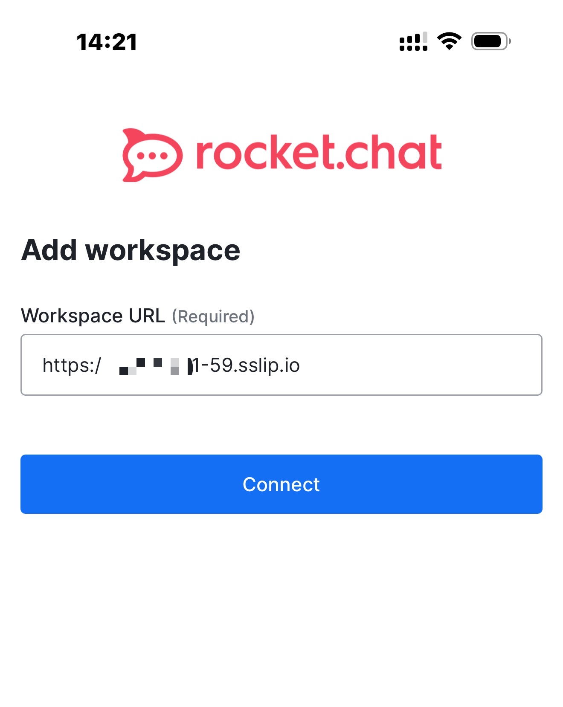
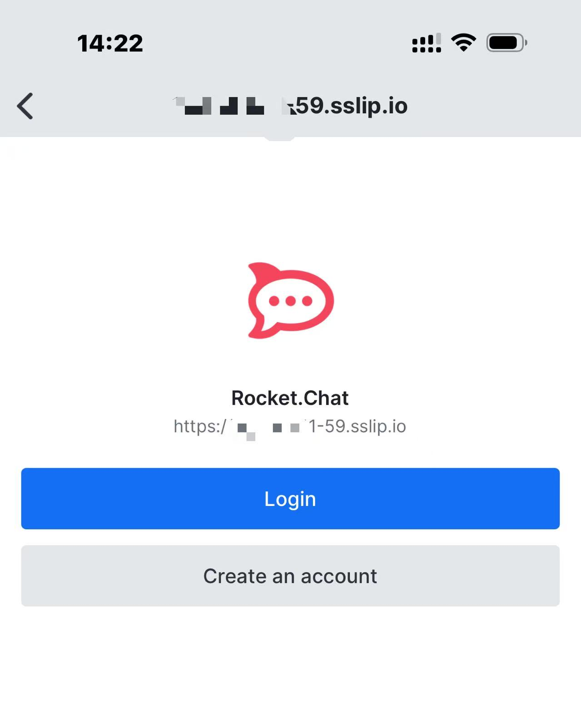
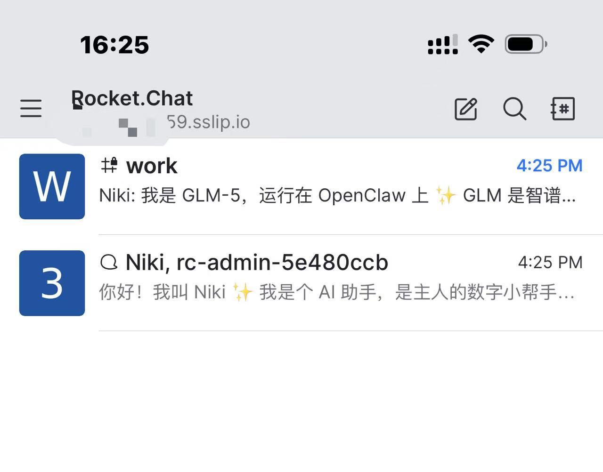
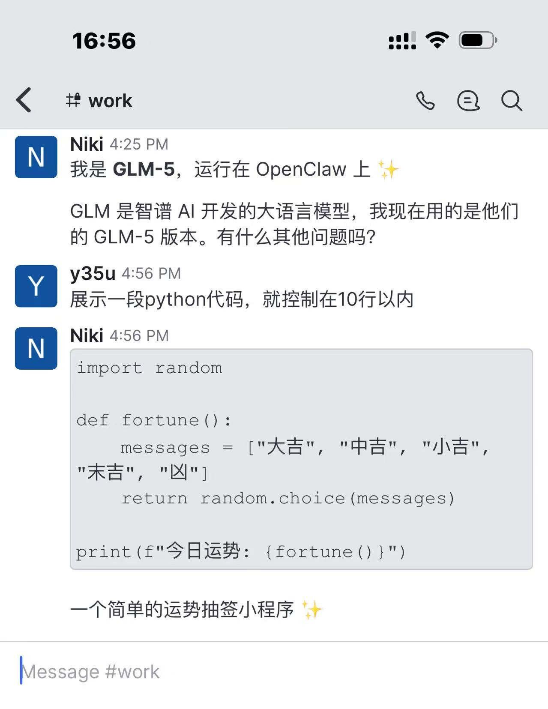

<div align="center">

# 🦞 openclaw-rocketchat

**The Missing Channel for OpenClaw Users in China**

[](https://www.npmjs.com/package/openclaw-rocketchat)
[](LICENSE)
[](https://github.com/Kxiandaoyan/openclaw-rocketchat)
[](https://nodejs.org/)
[](https://www.typescriptlang.org/)

[中文](./README.md) | **English**

---

**Chat with your OpenClaw AI via Rocket.Chat App**
**Dedicated Space · Dedicated Notifications · Self-Hosted · No VPN Required**

</div>

> **📖 Docs:** [Guide](docs/GUIDE.en.md) · [FAQ](docs/FAQ.en.md) · [Configuration](docs/CONFIGURATION.en.md) · [Architecture](docs/ARCHITECTURE.en.md) · [Security](docs/SECURITY.en.md) · [Multi-Agent](docs/MULTI-AGENT.en.md) · [Multi-Channel](docs/MULTI-CHANNEL.en.md)

---

## The Problem

OpenClaw supports Telegram, WhatsApp, Discord, and 10+ other messaging platforms. Users worldwide can chat with their AI assistants through their favorite apps.

**But what about users in mainland China?**

- Telegram — blocked by the Great Firewall
- WhatsApp — requires a foreign phone number
- Discord — completely inaccessible
- Feishu (Lark) — complex setup, requires enterprise account

And there's a deeper problem: **even if these platforms work, your AI conversations get buried in social noise** — friend messages, group chats, channel updates. Important AI responses disappear in the flood.

## The Solution

> **What is Rocket.Chat?** [Rocket.Chat](https://www.rocket.chat/) is the world's largest open-source enterprise messaging platform, used by 12M+ users globally. Think of it as a self-hosted Slack/Teams you can run on your own server — polished UI, full-featured, multi-platform (phone/desktop/web), and downloadable from China's App Store.

This plugin connects OpenClaw to **Rocket.Chat**. One command to deploy. Three steps to start chatting. **Your AI data never passes through third parties.**

## Ten Advantages

- 🏠 **Dedicated AI Workspace** — Open Rocket.Chat and see only your AI assistants, no social noise
- 🔔 **Dedicated Push Notifications** — AI messages aren't buried in other app notifications
- 🔐 **Complete Data Sovereignty** — Messages stay on your server, never touch third parties
- 🇨🇳 **Works Perfectly in China** — Direct App Store download, no VPN, auto free domain + HTTPS cert
- ⚡ **One-Command Deployment** — Interactive wizard handles Docker, accounts, and config in one go
- 🤖 **Multi-Agent, Multi-Bot** — Each Agent maps to a dedicated Rocket.Chat bot
- 👥 **Team Collaboration** — Share AI across your whole team in the same group
- 🔒 **Fine-Grained Permissions** — Full access / read-only roles for different team members
- 📱 **Cross-Platform** — iOS, Android, macOS, Windows, Linux, Web — real-time sync across all devices
- 🆓 **Free & Open Source** — MIT license, no subscriptions, no message limits, no vendor lock-in

### Technical Features (v0.7.1)

| Feature | Description |
|---------|-------------|
| Typing Indicator | Shows "typing..." on phone while the Agent is thinking |
| Threaded Replies | Agent replies are linked to the corresponding message thread |
| Group History Context | When @mentioned, Agent sees recent group conversation for context |
| Sender Identity | Agent distinguishes who is speaking in group chats |
| Media File Upload | Agent-sent images/files are actually uploaded to Rocket.Chat |
| @Mention State | Correctly passes `WasMentioned` field, matching official channel behavior |
| authToken Compat | Auto-compatible with legacy credential format, no re-add needed |
| One-Click Upgrade | `openclaw rocketchat upgrade` auto backup/restore config |
| Security Hardening | Install script auto-generates strong random admin password, eliminating `admin/admin` risk |
| Install Info Persistence | Install info saved to `.rc-info`, setup auto-reads it — zero manual input |

## Comparison

|  | Feishu | Telegram | WhatsApp | This Plugin |
|---|---|---|---|---|
| **China Available** | ✅ | ❌ VPN needed | ❌ Foreign # needed | ✅ |
| **Setup Complexity** | 🔴 High | 🔴 High | 🔴 High | 🟢 One command |
| **Data Privacy** | 🟡 Via 3rd party | 🟡 Via 3rd party | 🟡 Via 3rd party | 🟢 Fully local |
| **Multi-User Team** | Enterprise only | ❌ | ❌ | ✅ One deploy for all |
| **Free & Open Source** | ❌ | ❌ | ❌ | ✅ MIT |

> Full comparison table at [docs/ARCHITECTURE.en.md](docs/ARCHITECTURE.en.md)

## Quick Start (3 Steps)

> **Full walkthrough with terminal output examples: [Usage Guide](docs/GUIDE.en.md)**

### Step 1: Deploy Rocket.Chat

```bash
curl -fsSL https://raw.githubusercontent.com/Kxiandaoyan/openclaw-rocketchat/master/install-rc.sh | bash
```

The script auto-handles Docker deployment, free domain, and HTTPS certificate.

### Step 2: Install Plugin + Configure

```bash
openclaw plugins install openclaw-rocketchat
openclaw rocketchat setup
```

Interactive wizard guides you through connection and account creation. On the same machine, it auto-detects install info.

### Step 3: Add an AI Bot

```bash
openclaw rocketchat add-bot
```

Type a bot name, pick an Agent, done.

### Step 4: Download Rocket.Chat on Your Phone, Start Chatting

1. Search **"Rocket.Chat"** on App Store / Google Play
2. Open the app, enter server address (e.g. `https://123-45-67-89.sslip.io`)
3. Login with your credentials from Step 2
4. Find your bot and start chatting!

### 📱 Mobile App Screenshots

| Step | Screenshot |
|------|-----------|
| Open App, enter server URL |  |
| Tap Connect to reach login |  |
| Conversation list after login |  |
| Chat with your AI bot |  |

> **Highlight**: Code blocks in AI replies are **automatically syntax-highlighted and beautifully formatted** in Rocket.Chat App — unlike WeChat/DingTalk/Slack where code gets squished into unreadable blobs. A much better experience for developers and technical users.

## Commands

| Command | Description |
|---|---|
| `openclaw rocketchat setup` | Connect to Rocket.Chat + create admin + create phone account |
| `openclaw rocketchat add-bot` | Add bot + bind Agent + create DM |
| `openclaw rocketchat add-group` | Create private channel (multi-bot group) |
| `openclaw rocketchat add-user` | Add phone login user |
| `openclaw rocketchat remove-user` | Remove phone login user |
| `openclaw rocketchat invite` | Manage group members |
| `openclaw rocketchat status` | View running status |
| `openclaw rocketchat upgrade` | **One-click upgrade (auto backup/restore config)** |
| `openclaw rocketchat uninstall` | Uninstall |

All commands are **interactive** — no flags to memorize, just follow the prompts.

## Documentation

| Document | Content |
|----------|---------|
| [Usage Guide](docs/GUIDE.en.md) | Full step-by-step walkthrough, terminal output examples, remote deployment, user management |
| [FAQ](docs/FAQ.en.md) | Registration disabled, upgrades, reset, Docker commands, certificates, push notifications |
| [Configuration](docs/CONFIGURATION.en.md) | Full parameter tables, JSON example, manual editing, full reset |
| [Architecture](docs/ARCHITECTURE.en.md) | Full comparison table, architecture diagrams, tech stack |
| [Security](docs/SECURITY.en.md) | Password security, credential storage, backup/restore, file permissions |

## Contributing

Contributions welcome! Whether it's bug reports, feature suggestions, or code:

1. Fork this repository
2. Create your branch (`git checkout -b feature/amazing`)
3. Commit changes (`git commit -m 'Add amazing feature'`)
4. Push to remote (`git push origin feature/amazing`)
5. Create a Pull Request

## License

[MIT](LICENSE) — Free to use, free to modify.

---

<div align="center">

**If this plugin helps you, please give it a Star ⭐**

**Every Star shows support for the Chinese developer community 🇨🇳**

[](https://star-history.com/#Kxiandaoyan/openclaw-rocketchat&Date)

*Making AI assistants accessible to every user in China*

</div>
